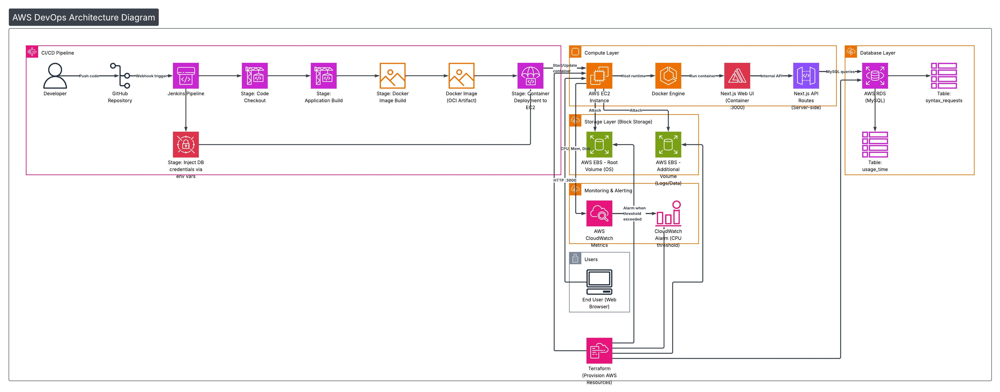

# **🧠SYNTAX CHECKER**
## **🔄End-to-End CI/CD DevOps Project**

---

## **📌Project Overview**

The **Syntax Checker** is a containerized web application deployed using a complete **CI/CD DevOps pipeline**.  
This project demonstrates how an application moves from **source code to a running service** using industry-standard DevOps tools and AWS cloud services☁️.

The primary focus of this project is **DevOps engineering**, including automation⚙️, containerization🐳, deployment🚀, and troubleshooting real-world issues.

---
## **AWS ARCHITECTURE**
<p align="center">
  
</p>

---

## **🎯Project Objectives**

- 🛠️ Build a CI/CD pipeline from scratch

- 🤖 Automate build and deployment using Jenkins

- 🐳 Containerize the application using Docker

- ☁️ Deploy and run the application on AWS EC2

- 🗄️ Integrate AWS RDS (MySQL) for data storage

- 🚨 Handle real production challenges (disk space, permissions, dependency conflicts)
---

## **🔍How the Project Works**

### **1️⃣ Source Code Management**
- 📂 Application source code is stored in GitHub.
- Repository contains:
  - Application code.
  - Dockerfile for containerization 🐳.
  - Jenkinsfile for CI/CD automation ⚙️.

---

### **2️⃣ Continuous Integration (Jenkins)**
- 🖥️ Jenkins is installed on an AWS EC2 instance

- 🔄 Jenkins pulls the latest code from GitHub

- 📜 Pipeline is defined using a Declarative Jenkinsfile


**Pipeline Responsibilities**
- 📥 Fetch source code

- 🏗️ Build Docker image

- 🚀 Deploy Docker container

---

### **3️⃣ Containerized Build (Docker)**
- 🐳 Application is built entirely inside Docker

- 📦 npm install and npm run build run during image creation

- ⚠️ Dependency conflicts handled at the Docker layer

- ✅ Ensures consistent builds across environments
---

### 4️⃣ Continuous Deployment
- 🚀 Jenkins deploys container on EC2
- 🔁 Old containers replaced
- 🌐 Runs on port **3000**
---

#### 5️⃣ Runtime Behavior
- 👤 User submits code
- 🧠 Backend validates syntax
- 🗄️ Data stored in AWS RDS
- ⏱️ Usage time recorded

---

## 🔁 CI/CD Flow

```
               👨‍💻 Developer
                    |
                    v
            📦 GitHub Repository
                    |
                    v
              ⚙️ Jenkins (EC2)
                    |
                    v
              🐳 Docker Build
                    |
                    v
            📦 Docker Container
                    |
                    v
        🚀 Application Running on EC2

```
---


---

## 🧰 Technology Stack

### 🎨 Frontend
| Technology | Purpose |
|----------|--------|
| Next.js | Frontend framework |
| React | UI |
| TypeScript | Type safety |
| Tailwind CSS | Styling |
| ShadCN UI | UI components |

---

### 🧠 Backend
| Technology | Purpose |
|----------|--------|
| Node.js | Runtime |
| Next.js API Routes | Backend |
| MySQL | Database |

---

### ☁️ DevOps & Cloud
| Tool | Purpose |
|----|-------|
| AWS EC2 | Jenkins & App Host |
| AWS RDS | MySQL |
| Docker | Containerization |
| Jenkins | CI/CD |
| Git & GitHub | Source control |
| Ubuntu | OS |
| EBS | Extra storage |

---

## 🗂️ Root Project Structure


```
syntax-checker/
├── app/
├── Dockerfile
|── lib/
├── Jenkinsfile
├── package.json
├── infrastructure/
└── README.md
```
---

---

## 🔐 Environment Configuration

Create `.env.local`:


```
DB_HOST=<endpoint value>
DB_USER=<sql username>
DB_PASSWORD=<password>
DB_NAME=<database name>

```
---


---

## 🚀 Project Execution Steps

### 🏗️ Step 1: Provision Infrastructure (Terraform)

```bash
terraform init
terraform plan
terraform apply

```
---

## **🔑Step 2: Connect to the AWS EC2 Instance and install my sql**

After the infrastructure is successfully created:

Open the AWS Management Console.

Navigate to EC2 → Instances.

Select the newly created EC2 instance.

Connect to the instance using SSH.

 install my sql:
```
sudo apt update
sudo apt install mysql-client -y

```
---
## **📥Step 3: Clone the Project Repository**

Once connected to the EC2 instance, clone the GitHub repository:

git clone https://github.com/anjan816/syntax-checker.git

cd syntax-checker


---
## **🧩Step 4: Install Required Tools**

Install the necessary tools inside the EC2 instance:

- 🐳 Docker.

- ⚙️ Jenkins.

Ensure that:

Docker service is running.

Jenkins is installed and accessible.

---

## **⚙️Step 5: Configure Jenkins Pipeline**

Open Jenkins in a browser:

http://<EC2_PUBLIC_IP>:8080


Create a new Pipeline job.

Configure the pipeline with the following details:

Git Repository URL:

https://github.com/anjan816/syntax-checker.git


Branch->main.

Script Path->Jenkinsfile.

Save the configuration and click Build Now.

Jenkins will automatically:

Pull the source code and Build the Docker image

Deploy the application container.

---
## **🌍Step 6: Access the Application**

After the Jenkins pipeline completes successfully, open a new browser tab and visit:

http://<EC2_PUBLIC_IP>:3000

The Syntax Checker application should now be running.

---
## **Steps to Check AWS RDS (MySQL)**

This section explains how to verify that the AWS RDS instance is running correctly and how to access it from an EC2 instance.

---

## **🗄️Step 1: Verify RDS Instance Status**

1. Open the **AWS Management Console**
2. Navigate to **RDS → Databases**
3. Select your RDS instance
4. Ensure the **Status** is:

## **Step 2: Check RDS Configuration**

From the RDS instance details page, verify:
- **Engine**: MySQL
- **Endpoint**: `<rds-endpoint>.ap-south-1.rds.amazonaws.com`
- **Port**: `3306`
- **DB Name**: `syntaxdb` (or your configured database)

---
## **Step 3: Verify Security Group Rules**

Ensure the RDS security group allows inbound traffic:

- **Type**: MySQL/Aurora
- **Port**: `3306`
- **Source**:
- EC2 security group (recommended), or
- EC2 private IP / VPC CIDR

This allows the EC2 instance to connect to RDS.

---
## **Step 4: Connect to EC2 Instance**

SSH into the EC2 instance where the application is running:

```bash
ssh -i <key.pem> ubuntu@<EC2_PUBLIC_IP>

```

## **Step 5: Connect to RDS from EC2**

Use the RDS endpoint to connect:
```
mysql -h <RDS_ENDPOINT> -u <DB_USERNAME> -p


Enter the database password when prompted.
```
---
## **Step 6: Verify Database and Tables**

Once connected to MySQL:
```
SHOW DATABASES;
USE syntaxdb;
SHOW TABLES;

```
Expected tables:
```
syntax_requests
usage_time
```

---

## **Step 7: Check Data Insertion**

Verify records are being stored:
```
SELECT * FROM syntax_requests;
SELECT * FROM usage_time;
```

If records are present, the RDS connection is working correctly.

---

## **Key Configuration Files**

| File | Description |
|----|------------|
| Dockerfile | Defines container build and runtime |
| Jenkinsfile | CI/CD pipeline definition |
| package.json | Dependency management |
| infrastructure/ | Infrastructure as Code (Terraform) |

---

## **⭐ Features Implemented**

- Jenkins CI/CD 🔄

- Dockerized build 🐳

- EC2 deployment 🚀

- AWS RDS integration 🗄️

- Usage tracking ⏱️

- Extra EBS volume 💽
---

## **🚧 Real DevOps Challenges Solved**

- Jenkins permission issues with Docker
- EC2 root disk exhaustion and resizing
- npm peer dependency conflicts
- Docker build failures
- Jenkins workspace cleanup and cache handling

---

## **Why This Project Matters**

This project demonstrates:
- Practical CI/CD implementation
- Cloud-based deployment experience
- Infrastructure troubleshooting
- Production-grade DevOps practices
- Automation and reproducibility

---

## **👨‍💻 Author**

**Anjan**  
DevOps & Cloud Engineer (Fresher)  
GitHub: https://github.com/anjan816

---

## **✅ Conclusion**

This project represents a complete **DevOps lifecycle**, covering CI/CD automation, containerization, cloud deployment, and real-world troubleshooting🚀.  
It is designed to reflect **industry standards** and serves as a strong **DevOps portfolio project**.


